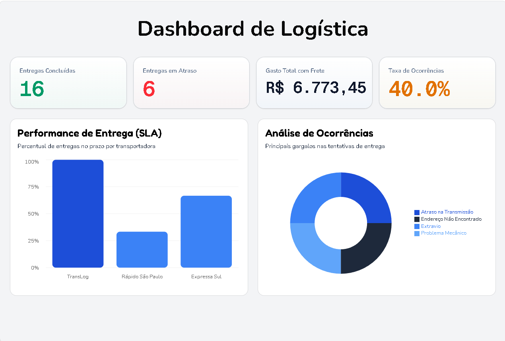

# Dashboard de Logística

Dashboard que lê um arquivo CSV ou Excel com dados de entregas e gera automaticamente indicadores e gráficos de logística: entregas concluídas, atrasos, gasto com frete, SLA por transportadora e ocorrências.

Demo: https://dashboard-logistica-nextjs.vercel.app/


## Demonstração

**Upload** — envio do arquivo CSV ou Excel via drag-and-drop ou seleção manual


**Dashboard** — indicadores e gráficos gerados automaticamente


## Funcionalidades

- Upload de CSV ou Excel via drag-and-drop ou seleção manual
- Cálculo automático de indicadores:
  - Entregas concluídas
  - Entregas em atraso
  - Gasto total com frete
  - Taxa de ocorrências
- Gráfico de performance de SLA por transportadora
- Gráfico de análise de ocorrências (donut) por motivo
- Layout responsivo

## Tecnologias

- Next.js
- React
- TypeScript
- Tailwind CSS
- Shadcn UI
- SheetJS (xlsx) para leitura do arquivo
- Recharts para os gráficos

## Formato do Arquivo

O arquivo precisa conter estas colunas:

- `Status`
- `Motivo`
- `Frete`
- `Previsão de Entrega` (dd/mm/aaaa)
- `Entrega` (dd/mm/aaaa)
- `Transportadora`

## Como rodar localmente

```bash
git clone https://github.com/kaykybazzan/dashboard-logistica-nextjs.git
cd dashboard-logistica-nextjs
npm install
npm run dev
```

Abra http://localhost:3000.

## Nota técnica

Datas podem vir de duas formas diferentes: como número serial (quando o arquivo é .xlsx) ou como string dd/mm/aaaa (quando é .csv puro). O parser de data trata os dois casos: tratar só um formato causava contagem errada de atraso e SLA.

O valor do frete também precisou de tratamento: arquivos no padrão brasileiro usam vírgula como separador decimal, e parseFloat sozinho ignora tudo depois da vírgula, então o valor precisa ser normalizado antes da conversão.

O campo `Status` também é digitado à mão e vem com variações de escrita ("ATRASADO", "atrasado ", "Atraso"). Um bug real aconteceu aqui: um title-case genérico capitalizava conectores tipo "com" (transformando "Entregue com Atraso" em "Entregue Com Atraso"), o que quebrava silenciosamente a comparação de string usada nos indicadores — 6 pedidos entregues com atraso simplesmente desapareciam dos contadores, sem gerar nenhum erro visível. A correção usa um dicionário de sinônimos fechado, em vez de title-case genérico, garantindo que o valor normalizado sempre bate com as strings que o resto do sistema espera.

## Decisões de Design

**Classificação de atraso é baseada em data, não em texto de Status.**
O campo `Status` é digitado manualmente e pode ficar desatualizado (alguém esquece de marcar "Atrasado" quando o prazo estoura). Por isso o sistema compara `Previsão de Entrega` com `Entrega` (ou com a data atual, se ainda não foi entregue) para decidir se um pedido está no prazo — o texto do Status só é usado para estados terminais como Cancelado, Devolvido e Extraviado, que uma data sozinha não explica.

Limitações conhecidas dessa abordagem:
- A comparação usa o fuso horário do navegador de quem abre o dashboard.
- Não considera calendário de dias úteis/feriados da transportadora.
- Pedidos sem `Previsão de Entrega` preenchida nunca são classificados como atrasados, mesmo que estejam parados há muito tempo — não há como inferir atraso sem uma data de referência.

## Autor

Kayky Bazzan
LinkedIn: https://www.linkedin.com/in/kaykybazzan
GitHub: https://github.com/kaykybazzan

## Licença

Proprietário — todos os direitos reservados © 2026